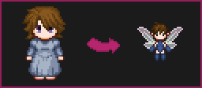
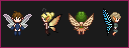
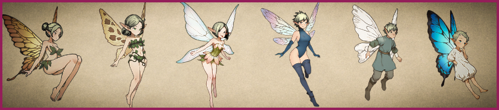
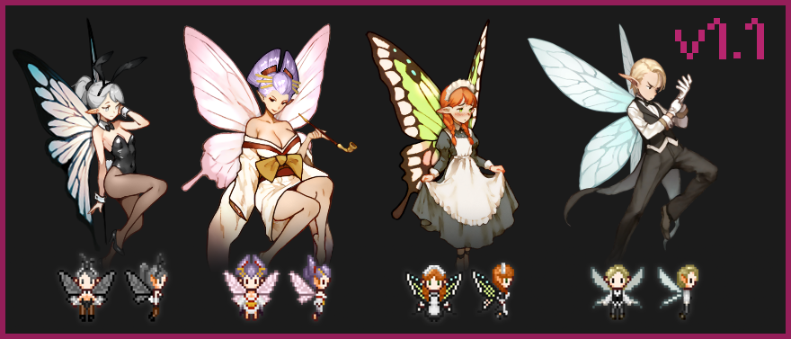
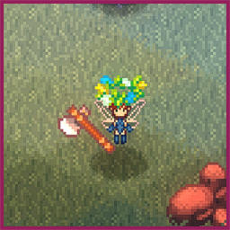
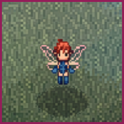
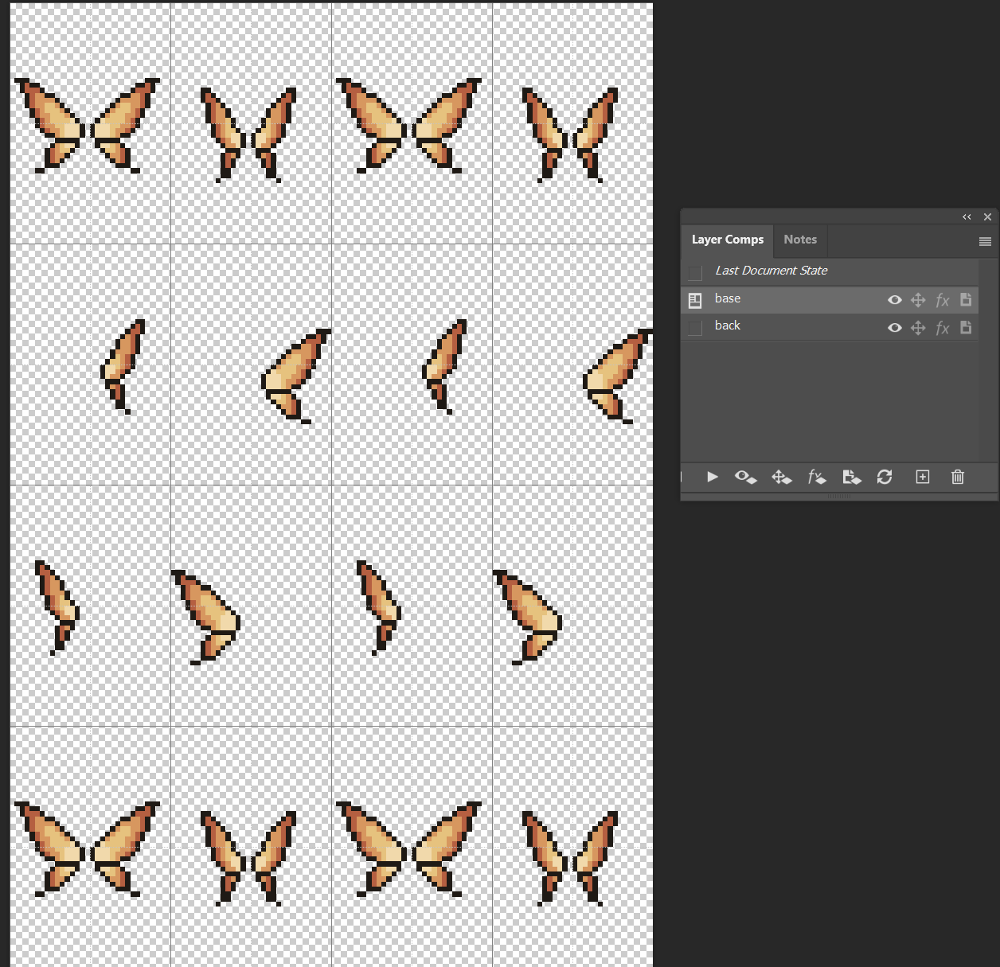
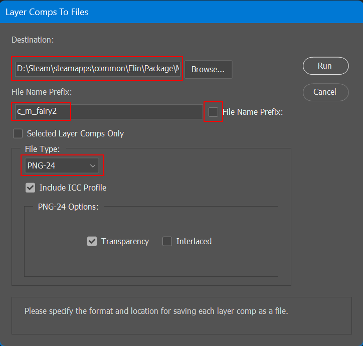

# Elin Fairies

----


### A Fairy PCC mod for [Elin](https://store.steampowered.com/app/2135150/Elin/)

I love that Elin lets you play as a fairy character, but was disappointed that the base
game doesn't really offer any way to visually differentiate a fairy character from the other
races.



This mod adds new portraits and sprites for fairy characters that are much smaller than the default sprites, including
a bunch of pretty fairy wings. The smaller stature of the PCC can cause some visual glitches, noted below, but for the
most part it works well.



Fairy portraits are all full-body to reflect the smaller stature of the fae.



---

## Character Creation

Since the game cannot differentiate fairy sprites from default sprites, you'll often find that the initial random
character will be confusing a mix of the two. Fairy sprites are all prefixed with `fairy` to make it easier to
find compatible sprites.

### Wings and Imports

Since the back slot is not available during the initial character creator you will need to either
use an import file with wings already set, or find a mirror in-game to adjust the back slot after creation.

Included in the mod directory is a set of templates for fairy characters with wings and outfits pre-applied.

You can find the mod folder by using the `Mod Viewer` on the title screen. Click the mod name and then
`Open in Explorer`.
Use the files in the `Template` folder with the `Import` function during character creation.

---

## Installation

a) Subscribe on [Steam Workshop](https://steamcommunity.com/sharedfiles/filedetails/?id=3400287057).

or

b) Download the latest [release](https://github.com/n15g/elin-fairies/releases) and unzip the contents into the
`Elin/Package` folder.

---

## Release Notes

### v1.1.0 - At your service!



**Breaking release** - Portrait filenames have changed and characters with a fairy portrait will need to re-set their
  portraits. This can be done in-game with a mirror, one of which can be found in the slave auction house in Derphy.

As an apology for the change, here's 4 new portraits and their associated sprite sets all with a "service" theme.

* NEW - 4 new portraits; 3 female, 1 male.
* NEW - 12 new sprites; 3 clothes, 2 gloves, 4 hair, 2 head, 1 mantle.
* NEW - 4 Templates.
* FIX - Fixed placement of wing 5 back sprite.
* FIX - Fixed sprite issue for glove 1.
* FIX - Fairy portraits have been re-labelled as special so that human NPCs will no longer randomly adopt fairy portraits.
* FIX - Coloring of bunny suit cloth/undie sprites has been darkened.
* DEV - Aseprite dev tools have been extracted to their own [project](https://github.com/n15g/aseprite-elin-devtools).

### v1.0.0 - Genesis

* NEW - 6 Portraits.
* NEW - 46 PCC sprites - 2 body, 2 boots, 12 clothes, 2 eye, 1 glove, 4 hair, 1 head, 8 mantle, 4 pants, 10 undies.
* NEW - 6 Templates.

---

## Known Issues

### Items



Game items that appear on the character, like tools or some headpieces are not scaled down, so they appear comically
large. For tools and weapons it's mostly amusing and stylistic, but clothing items look jarring.

### Zoom Aliasing



At the default zoom level the player sprites are slightly larger than the original sprite sheets. This causes some of
the rows and columns to be duplicated, causing a wonky look. This happens with normal PCC sprites as well, but it's a
lot
more pronounced with the smaller sprites that rely on single-pixel details. This can be fixed by adjusting the zoom
using the map tools button next to the minimap.

---

# Development

---

## Requirements

* **Photoshop** - For portrait source files in `.psd` format.
* **[Aseprite](https://www.aseprite.org/)** - For PCC sprites in `*.ase` format.
* **Python** - Build scripts and various tooling.

---

## PCC Sprites

PCC sprite source files are **[Aseprite](https://www.aseprite.org/)** `.ase` files.

A set of development tools for Aseprite as well as instructions for setting up PCC sprite files can be found at
the [asprite-elin-devtools](https://github.com/n15g/aseprite-elin-devtools) project.


---

## Portraits

Photoshop Layer Comps are used to output the overlay images for portraits.
Unfortunately the output options don't work well with Elin's naming convention, so there's
a small python script to rename the default filenames.

To export a portrait:

1. In Photoshop, `Window -> Layer Comps`
   
   You'll want two comps for a portrait:
    1. `base` - All visible layers on, this is your base portrait.
    2. `overlay` - Only the hair overlay layers enabled.
2. In Photoshop, `File -> Export -> Layer Comps to Files...`
   
    1. Set the `Destination` to the `Portrait` folder.
    2. Set the `File Name Prefix` to the portrait name.
    3. Un-check the `File Name Prefix` checkbox.
    4. Set the `File Type` to `PNG-24.
    5. Hit `Run`.
3. Run the Python script `dev/rename_layer_comps.py`
   ```
   python dev/rename_layer_comps.py
   ```
