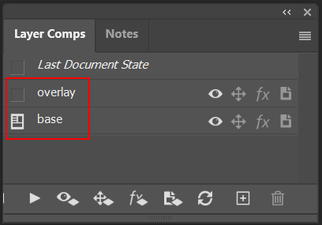

# Elin Fairies

----


Fairy PCC mod for [Elin](https://store.steampowered.com/app/2135150/Elin/)

#### Unwrap Layer Comps

Photoshop's layer comps are really useful for outputting linked sprites, but don't let you modify the
output filename meaningfully. This script unfolds the output layers to match Elin's format.

To unwrap the layer comps:

1. Set up Layer Comps via Window -> Layer Comps
   
2. In Photoshop, File -> Export -> Layer Comps to Files...
   
3. Rune the script `dev/unfold.py`

```
# Portraits
[base]      c_<base>_base.png -> c_<base>.png
[overlay]   c_<base>_overlay.png -> c_<base>-overlay.png

# Mantles
[base]      pcc_mantle_<base>_base.png -> pcc_mantle_<base>.png
[back]      pcc_mantle_<base>_back.png -> pcc_mantlebk_<base>.png
```

